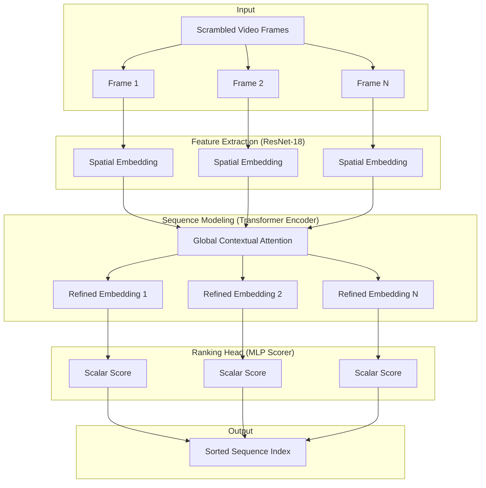

# Sherlock Files: Frame Reordering Model

## Project Overview
This project presents a deep learning solution for the **Sherlock Files** competition. The objective is to reconstruct the original chronological order of scrambled frames from corrupted video clips. By analyzing temporal continuity and physical motion cues, the model learns to assign a ranking score to each frame, enabling accurate sequence restoration.

## System Architecture

The model utilizes a hybrid CNN-Transformer architecture designed to capture both spatial features and global temporal relationships.



### Component Details
1.  **Spatial Feature Extractor:** A pretrained **ResNet-18** (ImageNet weights) processes each frame independently to extract 512-dimensional feature vectors.
2.  **Temporal Transformer:** A **Multi-Head Self-Attention Transformer Encoder** processes the set of frame embeddings. It looks for visual "trail" cues and physical consistency across the entire sequence.
3.  **MLP Scorer:** A fully connected network reduces the refined embeddings to a single scalar score.
4.  **Ranking Logic:** Frames are sorted based on their predicted scores to determine their final chronological position.

## Installation

1.  **Clone the Repository:**
    ```bash
    git clone https://github.com/ankushsingh003/MLWARE.git
    cd MLWARE
    ```

2.  **Environment Setup:**
    Ensure you have Python 3.8+ installed. Install dependencies using:
    ```bash
    pip install -r requirements.txt
    ```

## Usage

### Training
To train the model on the provided dataset:
```bash
python src/train.py --epochs 10 --batch_size 1 --data_dir dataset/train --labels_file dataset/train_labels.json
```
*Note: `batch_size=1` is recommended to handle varying video sequence lengths.*

### Inference
To generate a submission file for the test dataset:
```bash
python src/inference.py --model_path best_model.pth --data_dir dataset/test --output_csv submission.csv
```

## Evaluation Metric
The model performance is evaluated using **Kendall's Tau Correlation Coefficient**, which measures the ordinal association between the predicted and ground truth sequences:

$$\tau = \frac{C - D}{C + D}$$

Where:
- **C** is the number of concordant pairs.
- **D** is the number of discordant pairs.

## File Structure
- `src/`: Core logic (dataset loading, model architecture, loss functions).
- `train.py`: Training loop and validation logic.
- `inference.py`: Submission generation script.
- `rationale.md`: Design philosophy and technical reasoning.
- `best_model.pth`: Trained model weights.
